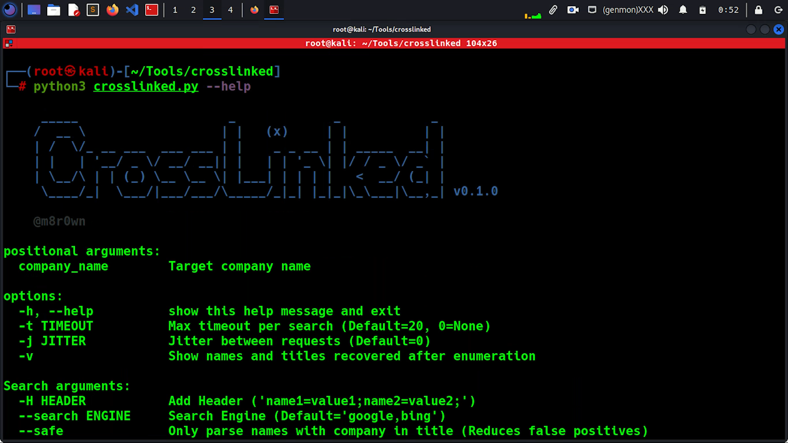
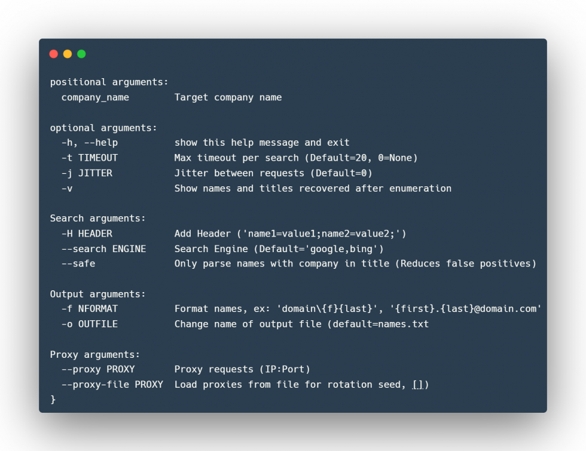

# Recon Tool: CrossLinked



## CrossLinked

CrossLinked by m8sec, is a LinkedIn enumeration tool that uses search engine

scraping to collect valid employee names from a target organization. This technique provides accurate results without the use of API keys, credentials, or even accessing the site directly. Formats can then be applied in the command line arguments to turn these names into email addresses, domain accounts, and more. This tool will help the red team and penetration testers perform a better targeted Phishing Attack Simulation in their assessments.

## Setup

```shell
git clone https://github.com/m8sec/crosslinked
```

```shell
cd crosslinked
```

```shell
pip3 install -r requirements.txt
```

## EXAMPLES

Results are written to a ‘names.txt’ file in the current directory unless specified in the command line arguments. See the Usage section for additional options.

```shell
python3 crosslinked.py -f '{first}.{last}@domain.com' company_name
```

```shell
python3 crosslinked.py -f 'domain\{f}{last}' -t 45 -j 1 company_name
```

## USAGE



## PROXY SUPPORT

The latest version of CrossLinked provides proxy support through the Taser library. Users can mask their traffic with a single proxy by adding –proxy 127.0.0.1:8080 to the command line arguments, or use –proxy-file proxies.txt for rotating source addresses.

http/https proxies can be added in IP:PORT notation, while SOCKS requires a socks4:// or socks5:// prefix.

Clone the repo from here: [GitHub Link](https://github.com/blackhatethicalhacking/CrossLinked)
